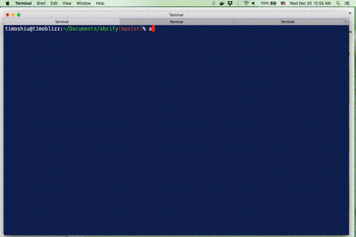

# abcify cli

[](https://travis-ci.org/timoweave/abcify)

This `abcify` walks the input AST with visitors to sort commutative expressions shown here:

1. object literal by keys,
2. es2015 object destructing by keys,
3. react jsx properties by names,
4. flow type object literal by keys,
5. flow union by this criteria (undefined < null < boolean < number < string),
6. switch cases by (undefined < null < boolean < number < string),

note: supporting es2015, react, and flow.



## SETUP

* `npm install abcify`

note:
- if needed, add `--save-dev` xor `--global` flag.
- if dependencies failed, run `npm install recast yargs flow-parser` again.

## EXAMPLE

* `abcify test/example.js` # to print abcified output to console or terminal.
* `abcify test/example.js -s` # to save abcified output to the input file.

where `test/example.js` input is shown here:

```javascript
"use strict";

import {z, y, x} from "./xyz.js";
import type {Y, X} from "./xyz.js";

const {c, b, a} = require("./abc.js");

type Numeric = 10 | 2 | 1 | -1;
type Strange = false | 400 | "hello" | undefined | 9 | "yes" | true | null | -5;
type Sizes = "pettie" | "small" | "medium" | "large";

type Obj = {
  "b;": boolean,
  "a:": number,
  e: Array<number>,
  d: {y: boolean, z: number, x: string},
  c: string,
};

const obj: Obj = {
  e: [3, 2, 1, 0],
  d: {z: 0, y: false, x: "hey"},
  c: "hello",
  "b;": true,
  "a:": 1,
};

console.log({k3: e, k2: d, k1: obj});

const {e, d: {y, x}} = obj;

const Box = (
  <div z="hello" y={true} x={1}>
    <div style={{weight: "100%", fontSize: "10px"}} className="hello">
      box
    </div>
  </div>
);

function test(a) {
  switch (a) {
    case 2:
    case 3:
    case 1:
    case "5":
      console.log("a is 1 < 2 < 3 < '5'");
      break;
    case "zebra":
    case "alpha":
    case "beta":
    case 10:
      console.log("a is 10 < 'alpha' < 'beta' < 'zebra'");
      break;
    case true:
    case false:
    case 20:
    case 15:
    case "b":
      console.log("a is boolean false < true < 15 < 20 < 'b'");
      break;
    case 100:
    case "a":
    case "200":
    default:
      console.log("a is default 100 < '200' < 'a' < default");
      break;
  }
}

```

where expected output is shown here:

```javascript
"use strict";

import {x, y, z} from "./xyz.js";
import type {X, Y} from "./xyz.js";

const {a, b, c} = require("./abc.js");

type Numeric = -1 | 1 | 2 | 10;
type Strange = undefined | null | false | true | -5 | 9 | 400 | "hello" | "yes";
type Sizes = "large" | "medium" | "pettie" | "small";

type Obj = {
  "a:": number,
  "b;": boolean,
  c: string,
  d: {x: string, y: boolean, z: number},
  e: Array<number>,
};

const obj: Obj = {
  "a:": 1,
  "b;": true,
  c: "hello",
  d: {x: "hey", y: false, z: 0},
  e: [3, 2, 1, 0],
};

console.log({k1: obj, k2: d, k3: e});

const {d: {x, y}, e} = obj;

const Box = (
  <div x={1} y={true} z="hello">
    <div className="hello" style={{fontSize: "10px", weight: "100%"}}>
      box
    </div>
  </div>
);

function test(a) {
  switch (a) {
    case 1:
    case 2:
    case 3:
    case "5":
      console.log("a is 1 < 2 < 3 < '5'");
      break;
    case 10:
    case "alpha":
    case "beta":
    case "zebra":
      console.log("a is 10 < 'alpha' < 'beta' < 'zebra'");
      break;
    case false:
    case true:
    case 15:
    case 20:
    case "b":
      console.log("a is boolean false < true < 15 < 20 < 'b'");
      break;
    case 100:
    case "200":
    case "a":
    default:
      console.log("a is default 100 < '200' < 'a' < default");
      break;
  }
}

```

where `git diff` of `test/example.js` is shown here:

```diff
diff --git a/test/example.js b/test/example.js
index aae57f9..0afd265 100644
--- a/test/example.js
+++ b/test/example.js
@@ -1,37 +1,37 @@
 "use strict";
 
-import {z, y, x} from "./xyz.js";
-import type {Y, X} from "./xyz.js";
+import {x, y, z} from "./xyz.js";
+import type {X, Y} from "./xyz.js";
 
-const {c, b, a} = require("./abc.js");
+const {a, b, c} = require("./abc.js");
 
-type Numeric = 10 | 2 | 1 | -1;
-type Strange = false | 400 | "hello" | undefined | 9 | "yes" | true | null | -5;
-type Sizes = "pettie" | "small" | "medium" | "large";
+type Numeric = -1 | 1 | 2 | 10;
+type Strange = undefined | null | false | true | -5 | 9 | 400 | "hello" | "yes";
+type Sizes = "large" | "medium" | "pettie" | "small";
 
 type Obj = {
-  "b;": boolean,
   "a:": number,
-  e: Array<number>,
-  d: {y: boolean, z: number, x: string},
+  "b;": boolean,
   c: string,
+  d: {x: string, y: boolean, z: number},
+  e: Array<number>,
 };
 
 const obj: Obj = {
-  e: [3, 2, 1, 0],
-  d: {z: 0, y: false, x: "hey"},
-  c: "hello",
-  "b;": true,
   "a:": 1,
+  "b;": true,
+  c: "hello",
+  d: {x: "hey", y: false, z: 0},
+  e: [3, 2, 1, 0],
 };
 
-console.log({k3: e, k2: d, k1: obj});
+console.log({k1: obj, k2: d, k3: e});
 
-const {e, d: {y, x}} = obj;
+const {d: {x, y}, e} = obj;
 
 const Box = (
-  <div z="hello" y={true} x={1}>
-    <div style={{weight: "100%", fontSize: "10px"}} className="hello">
+  <div x={1} y={true} z="hello">
+    <div className="hello" style={{fontSize: "10px", weight: "100%"}}>
       box
     </div>
   </div>
@@ -39,28 +39,28 @@ const Box = (
 
 function test(a) {
   switch (a) {
+    case 1:
     case 2:
     case 3:
-    case 1:
     case "5":
       console.log("a is 1 < 2 < 3 < '5'");
       break;
-    case "zebra":
+    case 10:
     case "alpha":
     case "beta":
-    case 10:
+    case "zebra":
       console.log("a is 10 < 'alpha' < 'beta' < 'zebra'");
       break;
-    case true:
     case false:
-    case 20:
+    case true:
     case 15:
+    case 20:
     case "b":
       console.log("a is boolean false < true < 15 < 20 < 'b'");
       break;
     case 100:
-    case "a":
     case "200":
+    case "a":
     default:
       console.log("a is default 100 < '200' < 'a' < default");
       break;
```
